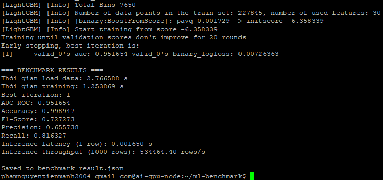
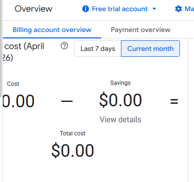

# Report nộp bài Lab

## 1. Screenshot terminal chạy `python3 benchmark.py`

### Benchmark



---

## 2. File `benchmark_result.json`

**Đính kèm file:** `./terraform-gcp/benchmark_result.json`

---

## 3. Screenshot GCP Billing Reports sau 1 giờ triển khai



> **Ghi chú:** Tại thời điểm chụp màn hình, mục Google Cloud Billing Reports vẫn hiển thị chi phí là ₫0, mặc dù hệ thống đã được triển khai thành công và quá trình benchmark đã hoàn tất. Điều này có thể do độ trễ trong việc cập nhật dữ liệu chi phí từ Google Cloud.

---

## 4. Mã nguồn thư mục `terraform-gcp/` đã chỉnh sửa

**Yêu cầu:** Nộp mã nguồn thư mục `terraform-gcp/` với các chỉnh sửa cho phương án CPU fallback.

### Đoạn cấu hình đã chỉnh sửa

```hcl
# scheduling {
#   on_host_maintenance = "TERMINATE"
#   automatic_restart   = true
# }

scheduling {
  on_host_maintenance = "MIGRATE"
  automatic_restart   = true
}
```

## 5. Báo cáo ngắn

Training trên CPU có thời gian huấn luyện lâu hơn GPU do khả năng xử lý song song kém hơn, nhưng chi phí triển khai thấp và phù hợp khi cần tối ưu ngân sách.
Chỉ số AUC về cơ bản không phụ thuộc vào CPU hay GPU, vì đây là kết quả của mô hình và dữ liệu, không phải phần cứng tính toán.
Inference trên CPU thường chậm hơn GPU nên latency cao hơn.
Việc dùng CPU thay GPU thường do giới hạn quota hoặc mục tiêu tiết kiệm chi phí trong giai đoạn thử nghiệm.
Với các bài lab nhỏ hoặc benchmark, CPU vẫn đáp ứng đủ để kiểm tra pipeline.
Do đó, lựa chọn CPU là sự đánh đổi giữa hiệu năng và chi phí/tính khả dụng.

---
